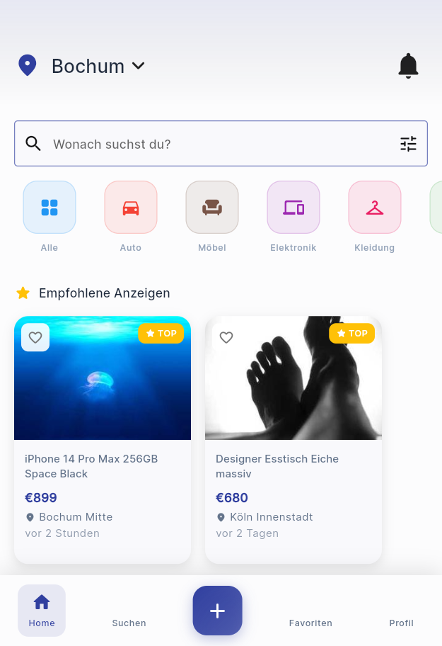
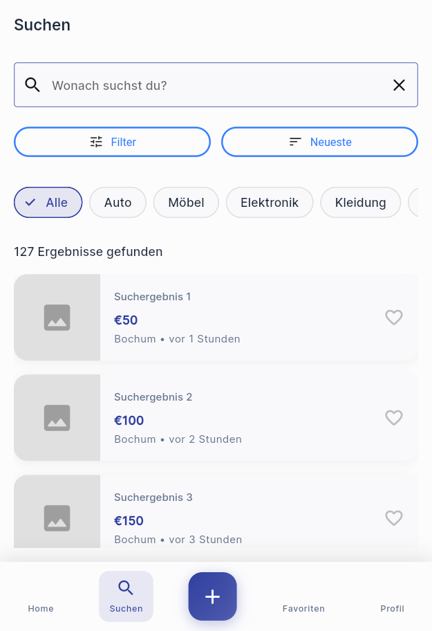
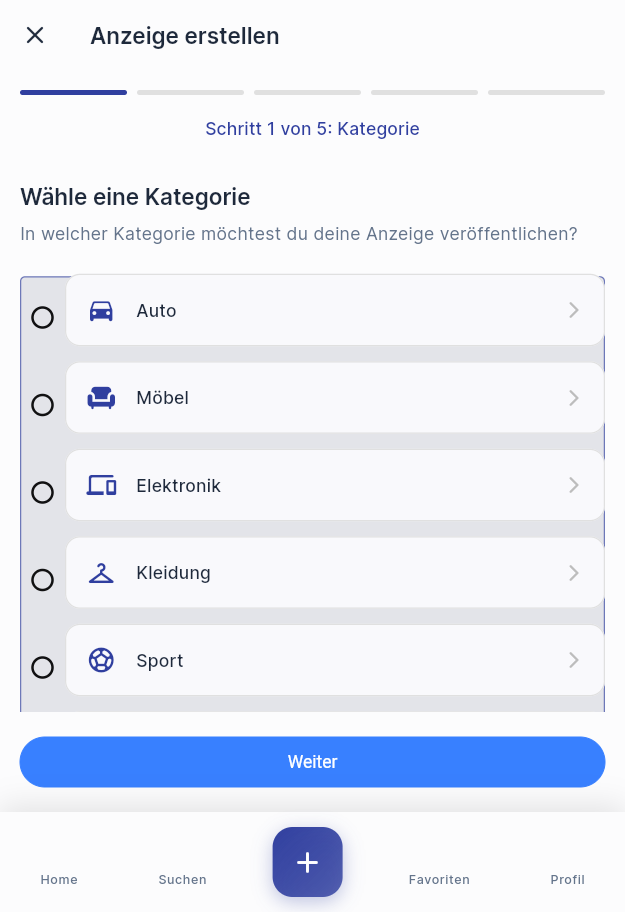
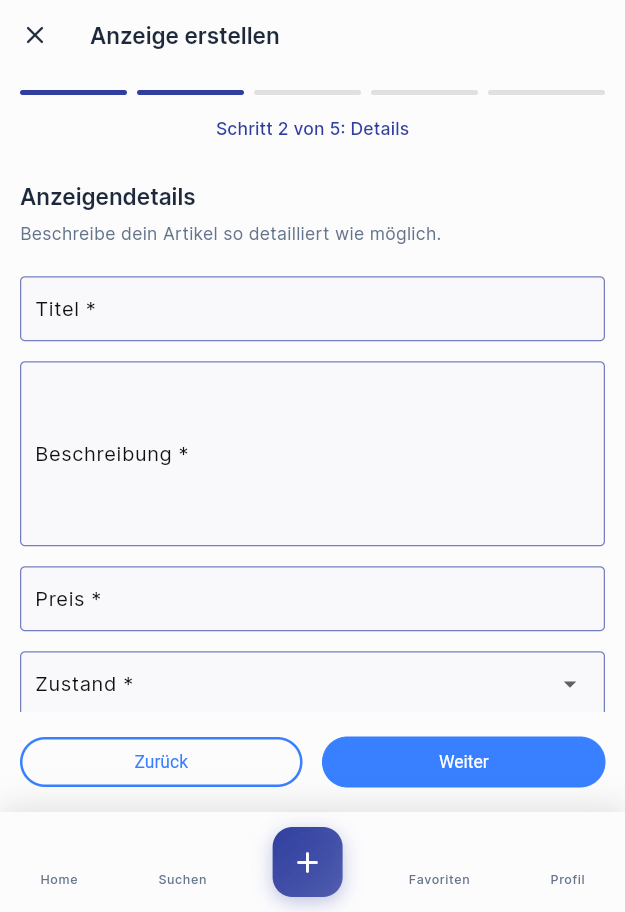
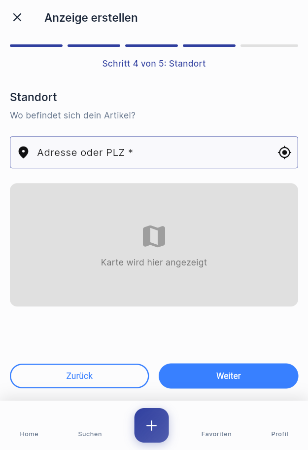
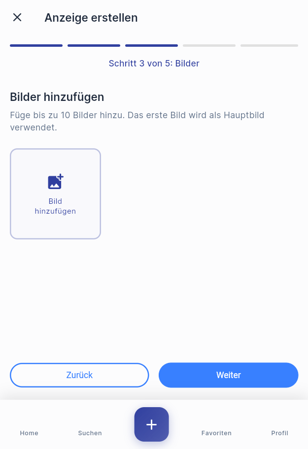
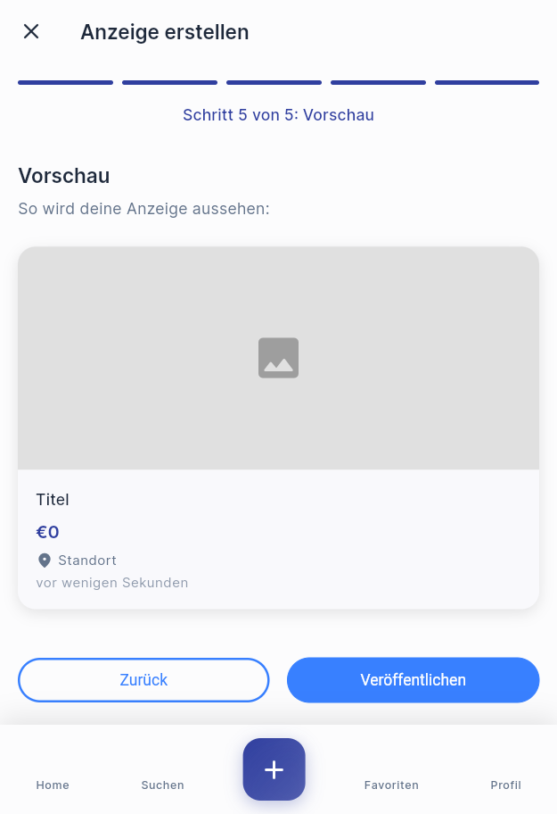
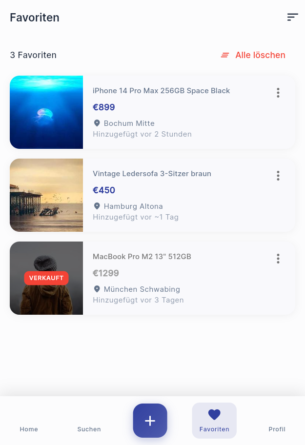
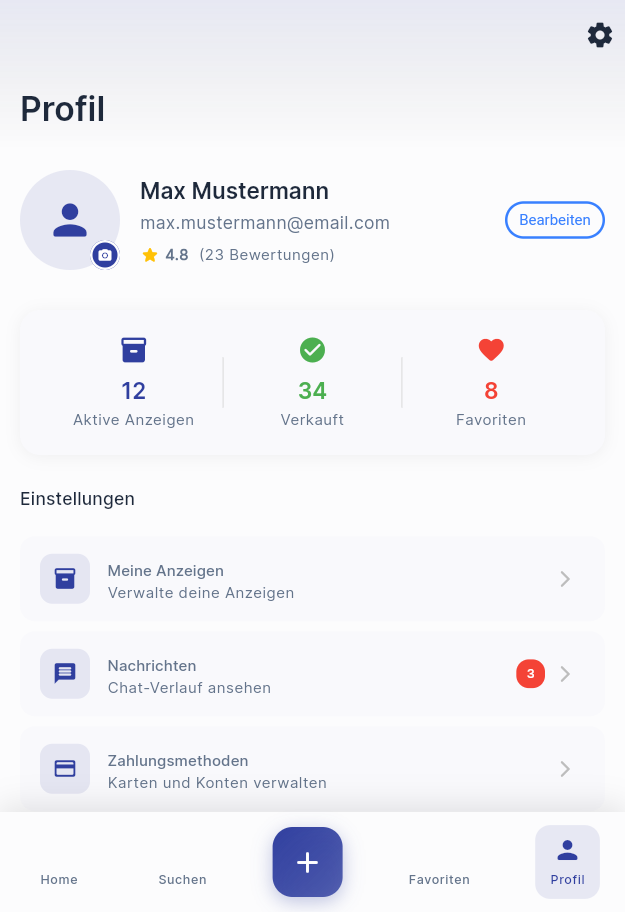
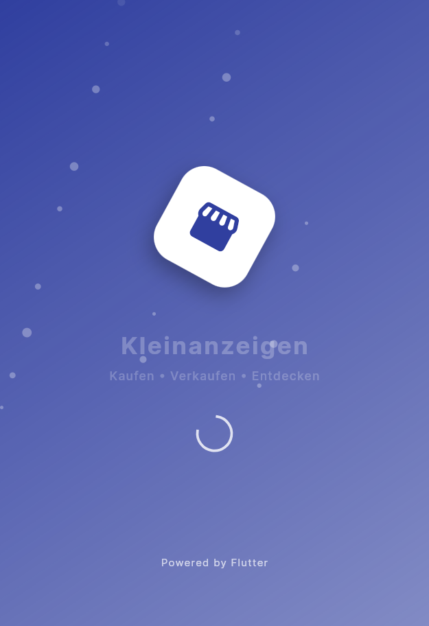

## 🖼️ Screens & UI Previews

| Screen File                        | Screenshot                                       | Description                               |
|-----------------------------------|--------------------------------------------------|-------------------------------------------|
| `home_screen.dart`                |      | Dynamische Kategorien & Startseite        |
| `search_screen.dart`              |  | Erweiterte Suche mit Filter & Sortierung  |
| `add_listing_screen.dart`         |        | Schritt 1 – Anzeige erstellen Start       |
| `add_listing_screen.dart`         |  | Schritt 2 – Details hinzufügen   |
| `add_listing_screen.dart`         |  | Schritt 3 – Adresse |
| `add_listing_screen.dart`         |  | Schritt 4 – Bilder hinzufügen     |
| `add_listing_screen.dart`         |  | Schritt 5 – Vorschau             |
| `favorites_screen.dart`           |  | Gespeicherte Anzeigen (Favoriten)         |
| `profile_screen.dart`             |  | Benutzerprofil & Einstellungen            |
| `animated_splash_screen.dart`     |  | Splash Screen mit Animationen             |
